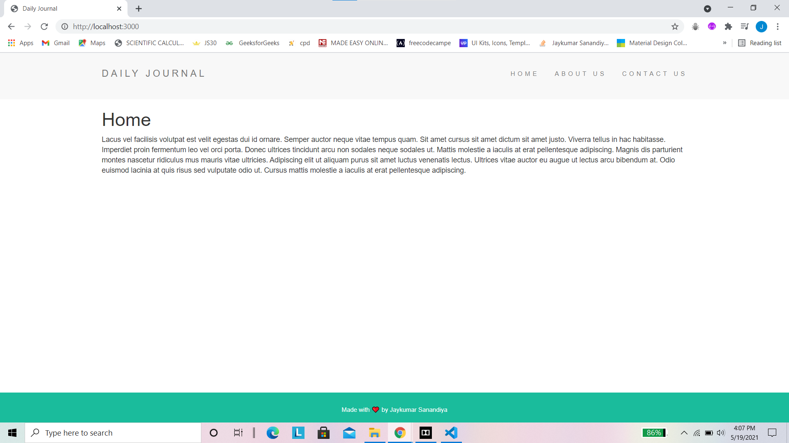
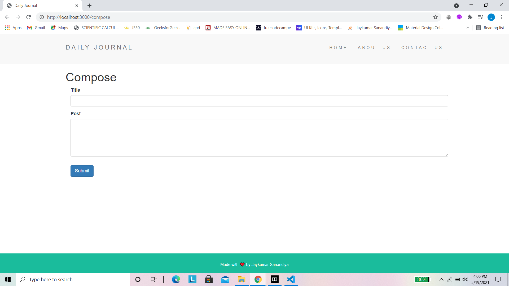
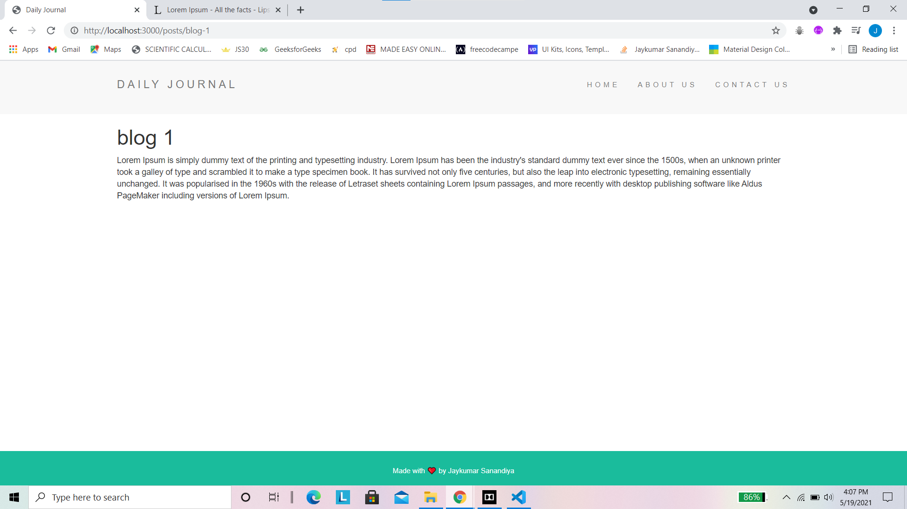
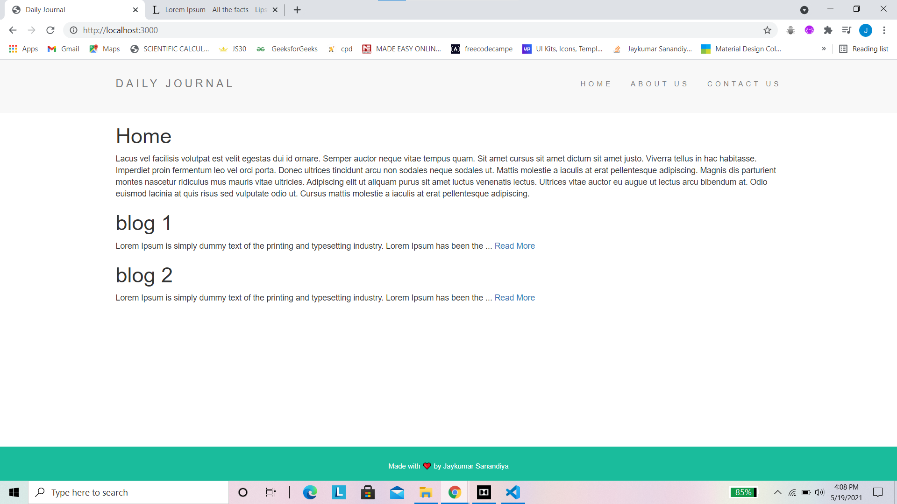

# Personal-Blogger-Maker
Blogger can compose blogs and add in website . User can see all blogs . NodeJS application. 
I have use concepts like EJS Templating , Passing Data , CSS etc.

Live Server Project on Heroku
https://mighty-savannah-42255.herokuapp.com/

# Home Page

# Compose Page

# Created Blog1 Page

# final Home Page

